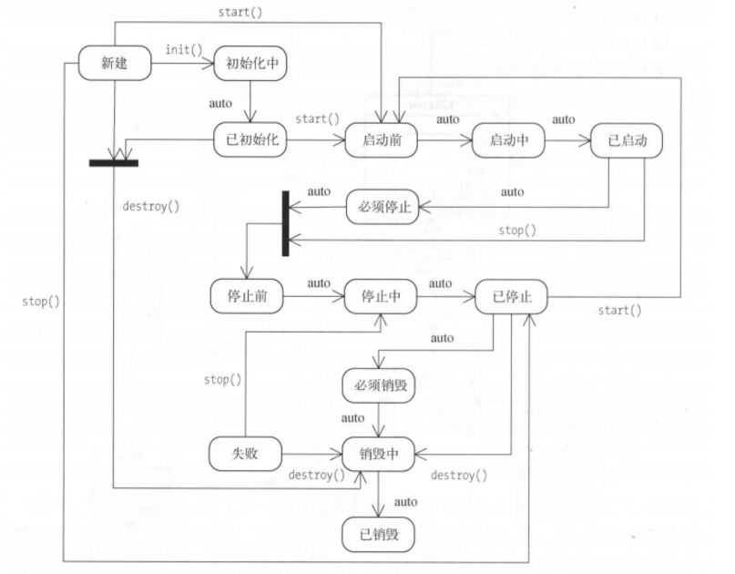
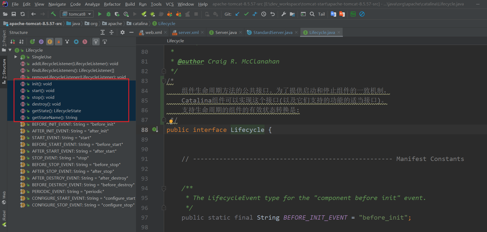

### LifeCycle类

  	 所有的容器中都存在start()、stop()等方法，因此抽象出Lifecycle接口，该接口中定义了相关的生命周期的方法。主要方法如下：

init
start
stop
destroy
getState
getStateName

### Pipeline\Valve

  	对于应用服务器来说，增强各组件的扩展性以及灵活性是非常重要的，Tomcat采用**职责链模式**来实现每个Container组件处理请求的功能。

  	Pipeline代表职责链，后者valve表示阀门，具体的处理过程.

​       说的简单点，就是每条线路上包含哪些操作，操作按照顺序一个个执行。Tomcat通过这种方式来决定每个容器的执行过程。之前的Tomcat架构图加上职责链如下所示：